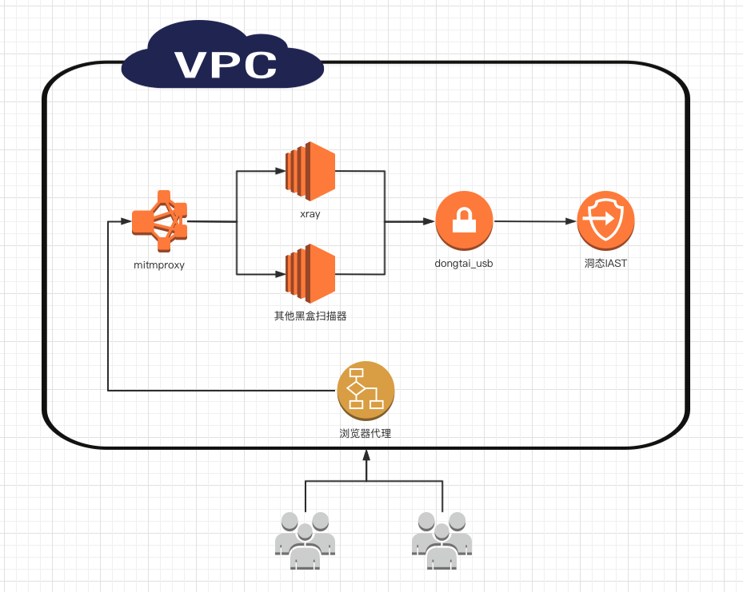

## Dongtai_USB
<br />

### 转换器配置文件(放在当前目录下)：config-tutorial.ini.example 
```
ip: xray访问地址白名单,默认不需要修改
iast_url：iast地址
dast_token： iast对应dast_token
xray_url：商业版xray地址
xray_token： 商业版xray-token
```

### 启动
```
mv config-tutorial.ini.example config-tutorial.ini
docker-compose up -d
添加代理：IP:10802
```
<br />
<br />

## 开发配置
### 数据上报流程: 
```
用户 ==> 浏览器代理 ==> mitmproxy ==> xray ==> dongtai_usb ==> 洞态IAST
```



1. agent 漏洞上报需要添加两个 header 响应头
```
Dt-Request-Id
dt-mark-header
```
2. 通过 mitmproxy 添加 dt-mark-header 响应头
```
flow.request.headers["dt-mark-header"] = uuid.uuid4().hex
```
3. Dt-Request-Id 响应头由 agent 创建
```
dt-request-id : <agent_id>.<uuid>
```


4. 发送给IAST的数据格式，可参考如下结构体Response，可直接调用
service.Client(Response) 发送数据给洞态iast,
```
type Response struct {
	VulName         string            `json:"vul_name"`
	Detail          string            `json:"detail"`
	VulLevel        string            `json:"vul_level"`
	Urls            []string          `json:"urls"`
	Payload         string            `json:"payload"`
	CreateTime      int64             `json:"create_time"`
	VulType         string            `json:"vul_type"`
	RequestMessages []RequestMessages `json:"request_messages"`
	Target          string            `json:"target"`
	DtUUIDID        []string          `json:"dt_uuid_id"`
	AgentID         []string          `json:"agent_id"`
	DongtaiVulType  []string          `json:"dongtai_vul_type"`
	Dtmark          []string          `json:"dt_mark"`
	DastTag         string            `json:"dast_tag"`
}
type RequestMessages struct {
	Request  string `json:"request"`
	Response string `json:"response"`
}

type Target struct {
	Params []struct {
		Path     []string `json:"path"`
		Position string   `json:"position"`
	} `json:"params"`
	URL string `json:"url"`
}
```

Response 结构体详解
```
{
    "vul_name": "",#漏洞名 格式为 target+漏洞类型
    "detail":"", #漏洞详情
    "vul_level": "HIGH", #HIGH,MEDIUM,LOW,NOTE 漏洞等级，对应现在洞态的4个等级
    "urls":[""],# 黑盒扫描发送的多个 url 地址
    "payload":"", #  黑盒扫描触发漏洞的 payload, 可为空
    "create_time":1679020853, # 时间戳(秒)
    "vul_type":"",#黑盒扫描的漏洞类型
    "request_messages":[{ # 一组扫描对应的所有请求和响应信息
        "request":"",
        "response":""
      }
    ],
    #以下为dongtai对接相关信息。
    "dt_mark": [""], # dt-mark-header 的值
    "target":"", # 原始请求地址
    "dt_uuid_id":[""], # 需要在 dt-request-id 响应头拆分出来
    "agent_id":[""], # 需要在 dt-request-id 响应头拆分出来
    "dongtai_vul_type":[""],# 洞态的漏洞类型, 多个类型，为空数组即对应所有调用链漏洞
    "dast_tag":"", # 所集成的黑盒扫描器标识
}
```


如何开发一个新的黑盒扫描器
```
1. 在dongtai_usb/目录下创建一个新的文件夹，文件夹名字为黑盒扫描器的名字
2. 在新建的文件夹下创建三个子目录,可参考xray目录
	1. dongtai_usb/xxx/engine/  # 数据处理转换 代码
	2. dongtai_usb/xxx/model/ # 请求结构体 代码
	3. dongtai_usb/xxx/request/ # 接收或拉取请求实现 代码

3. 漏洞类型可使用map对应，参考: dongtai_usb/xray/model/vultype.go
	1. Vultype 为漏洞类型命名
	2. VulLevel 为漏洞等级命名
```
漏洞类型等级对应关系
```
func Vultype() map[string]string {
	return map[string]string{
		//xray漏洞类型     //洞态漏洞类型
		"xss":            "reflected-xss",
		"sqldet":         "sql-injection",
		"cmd-injection":  "cmd-injection",
		"path-traversal": "path-traversal",
		"xxe":            "xxe",
		"ssrf":           "ssrf",
		"brute-force":    "crypto-bad-ciphers",
		"redirect":       "unvalidated-redirect",
	}
}
func VulLevel() map[string]string {
	return map[string]string{
		//xray漏洞名字     //洞态漏洞等级
		"xss":            "MEDIUM",
		"sqldet":         "HIGH",
		"cmd-injection":  "HIGH",
		"path-traversal": "HIGH",
		"xxe":            "MEDIUM",
		"ssrf":           "ssrf",
		"brute-force":    "LOW",
		"redirect":       "LOW",
	}
}
```
### 开发完成后在main方法添加路由接收即可，如xray
```
router.POST("/v1/xray", USB_Xray.Xray)
```